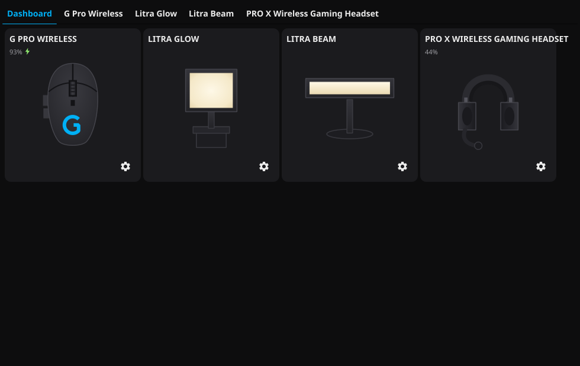
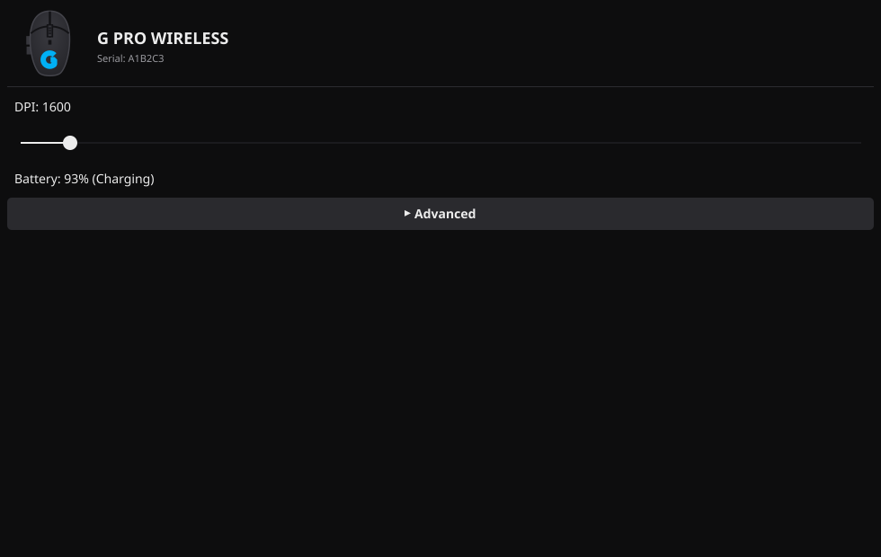

# LogiTux

A native Linux GUI for controlling Logitech devices — the Logitech G HUB
equivalent for Linux. Written in Go.

LogiTux talks to hardware directly over Linux's `hidraw` interface (no
`libhidapi` dependency, no cgo for device I/O), so installation only needs
a Go toolchain and Fyne's usual GUI build dependencies.




## Status

v1 supports:

- **Litra Glow / Litra Beam** key lights — power, brightness, color
  temperature.
- **G Pro Wireless** mouse (direct or via its Lightspeed receiver) — DPI,
  report (polling) rate, and logo color always; battery and button
  remapping on units whose firmware exposes the corresponding HID++
  feature (see [Usage](#usage) — one of the two units this was tested
  against doesn't expose either, evidently handling them through the
  receiver's own protocol layer instead, so both are implemented as
  optional and degrade gracefully rather than being guaranteed).
- **PRO X Wireless Gaming Headset** — battery, sidetone, and a full
  per-band equalizer (band count/frequencies/dB range are read from the
  device, not assumed).

The UI is styled after Logitech's own G HUB: a near-black theme with a
cyan-blue accent, and a **Dashboard** tab that shows every connected
device as a clickable G HUB-style card (product render, name, battery
level if it has one — a bolt marks charging, and a settings button);
clicking one jumps to its own tab with full controls. Device tabs only
exist while that device is actually connected. Each tab keeps the one or
two settings you're likely to adjust often (power, brightness/DPI,
battery) directly visible, with everything else — color temperature,
report rate, RGB, button remapping, sidetone, the equalizer — tucked under
a collapsed "Advanced" section, which stays expanded or collapsed across
LogiTux's periodic re-polling rather than snapping shut on you. A system
tray icon offers quick per-device actions (power, DPI presets) without
opening the window.

The device layer is a plugin architecture (see [Architecture](#architecture)
below), so support for further Logitech hardware — other mice, keyboards,
headsets, webcams — can be added incrementally without changing the GUI or
core app.

## Quick start

```bash
git clone <this-repo>
cd LogiTux
./install.sh
```

`install.sh` will, on Debian/Ubuntu-based distros (including Linux Mint):

1. Install the Go toolchain (`golang-go`) if it's missing.
2. Install Fyne's build dependencies (`gcc`, `libgl1-mesa-dev`, `xorg-dev`).
3. Build LogiTux and install it to `~/.local/bin/logitux`.
4. Install a udev rule granting your user access to supported devices'
   `hidraw` nodes (and `/dev/uinput`, used only if you remap a mouse
   button), and a `.desktop` launcher entry.

On other distros, install Go 1.22+ and Fyne's build dependencies yourself
(see the [Fyne getting-started guide](https://docs.fyne.io/started/)) and
then run `./install.sh` — it will skip the apt-specific steps.

After installing, **unplug and replug your device** so the new udev rule
applies, then launch LogiTux from your application menu or run
`~/.local/bin/logitux`.

To remove everything `install.sh` set up, run `./uninstall.sh`.

## Usage

LogiTux polls for supported devices every few seconds. Each connected
device gets its own tab (tabs disappear when a device is unplugged), with
whichever controls it supports — a power checkbox, sliders, dropdowns, a
color picker. Changes are applied immediately.

Closing the window minimizes LogiTux to the system tray rather than
quitting; use the tray menu's "Quit" item to actually exit. The tray also
has a submenu per connected device for one-click actions (e.g. a light's
"Turn On"/"Turn Off", or a mouse's DPI presets) without opening the window.

Devices that can't report their own state back over USB (Litra lights;
the G Pro Wireless's DPI/report-rate/battery/color often *can* be read
back live and are) fall back to the last value LogiTux sent, kept in
`$XDG_CONFIG_HOME/logitux/state.json` (typically
`~/.config/logitux/state.json`). Most settings are only ever *applied* when
you interact with them — opening LogiTux never pushes a stale value to a
light that's currently off, for example. Button remaps are the one
exception (see below): they're re-applied automatically whenever a mouse
reconnects, since a remap that silently stopped working every time the app
restarted would defeat the point of the feature.

### Custom product images

Each supported product ships with an original render drawn for LogiTux
(Logitech's own product photography is copyrighted, so an MIT-licensed
project can't redistribute it). If you'd rather see the official images,
you can supply your own: drop a file into
`$XDG_CONFIG_HOME/logitux/images/` (typically `~/.config/logitux/images/`)
named after the product — lowercased, spaces as dashes — with a `.png`,
`.jpg`, `.jpeg`, or `.svg` extension, e.g. `g-pro-wireless.png`,
`litra-glow.png`, or `pro-x-wireless-gaming-headset.png`. LogiTux picks
these up at startup and uses them everywhere the built-in render would
appear. Such images are for your own local use; don't commit them to a
public fork.

### Button remapping

If the mouse's firmware exposes the `REPROG_CONTROLS` feature (0x1B00
through 0x1B04) — not universal; see [Status](#status) — its remappable
buttons each get a dropdown to retarget them to another mouse button or a
keyboard key, or restore "Default". If the feature isn't present, this
section just doesn't appear; the rest of the mouse's controls are
unaffected.

This works by telling the mouse to stop sending that button's normal click
and instead report presses as a raw event, which LogiTux then translates
into a synthetic key/button press via a virtual input device
(`/dev/uinput`). That means **a remapped button only works while LogiTux is
running** — if LogiTux isn't running (not started yet, crashed, or killed
without a chance to clean up), that button does nothing at all, unlike
every other setting here, which simply stops being adjustable rather than
breaking the button. LogiTux reverts every active remap when it exits
normally (including from the tray's "Quit"), so a clean shutdown always
restores normal clicking.

## Architecture

```
cmd/logitux/             GUI entry point (Fyne): window, tabs, dashboard, systray, widgets
internal/hid/            Pure-Go hidraw backend: enumerate + open /dev/hidrawN
internal/hidpp/          HID++ 2.0 transport: feature calls, notifications, shared battery logic
internal/uinput/         Virtual input device, for button remapping
internal/device/         Plugin registry and capability interfaces
internal/device/litra/   Litra Glow/Beam plugin (simple vendor HID protocol)
internal/device/gpro/    G Pro Wireless plugin (HID++ 2.0 protocol)
internal/device/prox/    PRO X Wireless Gaming Headset plugin (HID++ 2.0 protocol)
internal/config/         JSON-backed last-known-state store
install/                 udev rules and .desktop launcher entry
```

Device support is added as a plugin: a package registers the vendor/product
IDs it handles with `internal/device.Register` in an `init()` function (see
`internal/device/litra/litra.go`, `internal/device/gpro/gpro.go`, or
`internal/device/prox/prox.go`), and implements whichever capability
interfaces the hardware supports (`PowerControl`, `DPIControl`,
`ButtonRemapControl`, `EqualizerControl`, ...). The GUI never references a
specific product — it type-asserts each discovered `device.Device` against
the capability interfaces and renders whatever controls apply. Adding a new
device means writing a new plugin package and importing it (for its
`init()` side effect) from `cmd/logitux/main.go`; no other files need to
change.

Most Logitech peripherals beyond simple lights (mice, keyboards, headsets)
speak Logitech's **HID++ 2.0** protocol: a request/response feature-call
system rather than the Litra's fixed byte sequences. `internal/hidpp`
implements that transport (feature discovery via the Root feature,
request/response matching, unsolicited notifications), so a new HID++
device plugin only needs to know which feature IDs it uses and their byte
layouts — see `internal/device/gpro` for a worked example covering DPI,
report rate, RGB, and button remapping, and `internal/device/prox` for a
per-band equalizer. Battery support (a four-tier feature-ID fallback, since
different units implement different ones — verified the hard way, against
real hardware that needed each of the fallback tiers) lives once in
`internal/hidpp/battery.go` and both device plugins just call into it,
rather than each having its own copy.

## Development

```bash
make build   # -> bin/logitux
make test    # go vet + go test ./...
make run     # build and run
```

## Credit

All product artwork in LogiTux (the dashboard renders and generic device
icons) is original, drawn for this project; none of it is Logitech's
imagery. "Logitech", "G HUB", and the product names are Logitech
trademarks, used here only to identify the hardware being controlled.

The Litra USB protocol was originally reverse-engineered by
[kharyam/go-litra-driver](https://github.com/kharyam/go-litra-driver) (and
its Python predecessor, [kharyam/litra-driver](https://github.com/kharyam/litra-driver)).
LogiTux's Litra plugin is an independent implementation of that protocol,
built on LogiTux's own pure-Go hidraw backend rather than `libhidapi`.

HID++ 2.0 feature byte layouts used by the G Pro Wireless plugin were
verified against [pwr-Solaar/Solaar](https://github.com/pwr-Solaar/Solaar),
the most complete existing Linux HID++ implementation, rather than guessed
from general protocol documentation.

## License

MIT — see [LICENSE](LICENSE).
